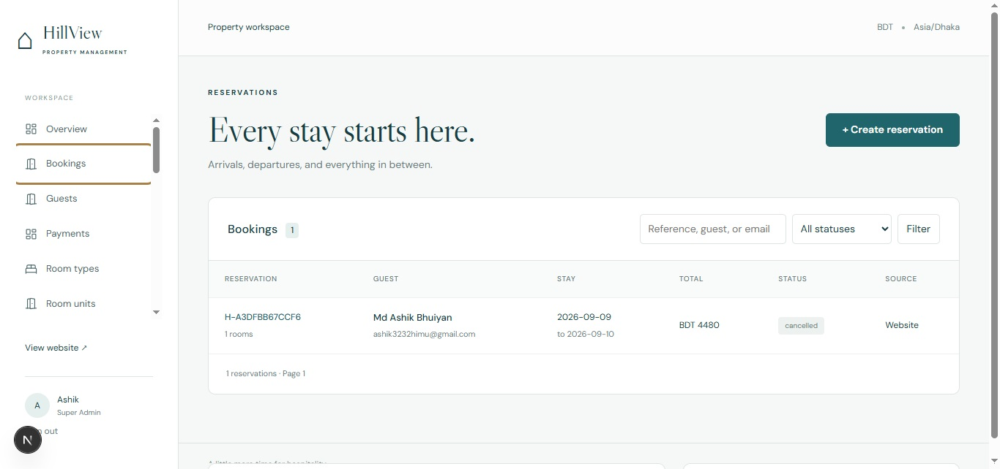
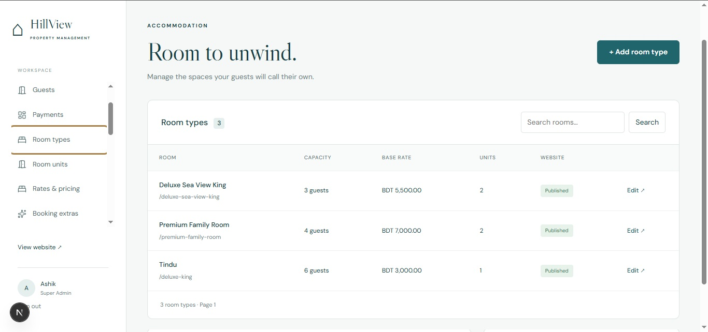
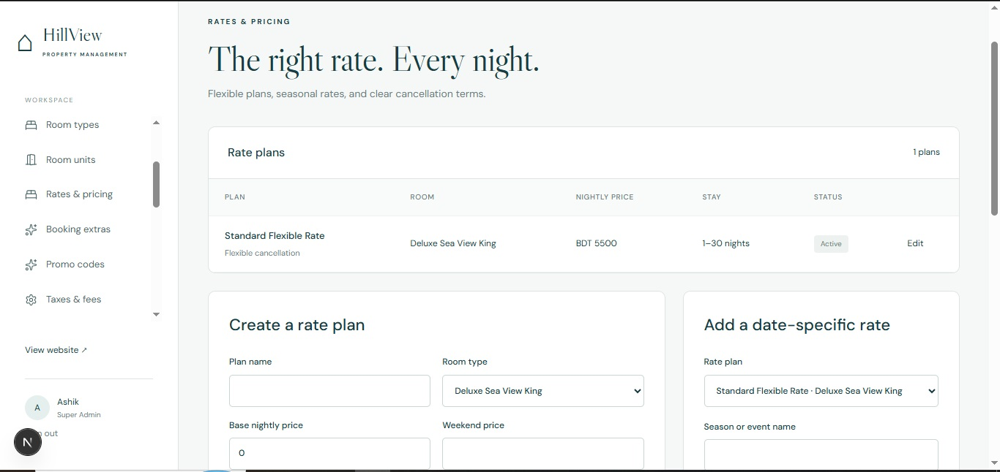
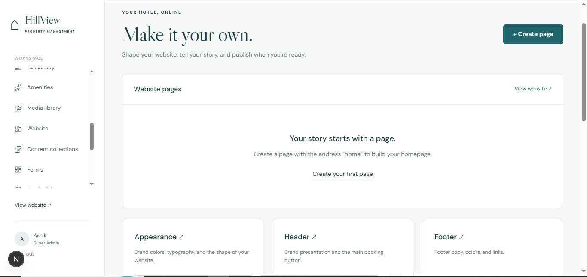
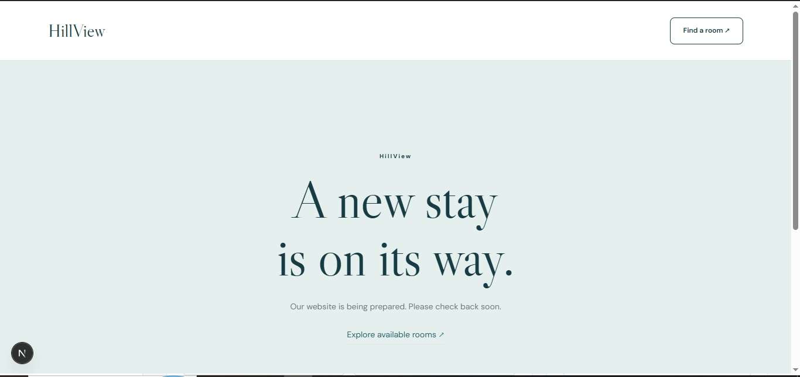
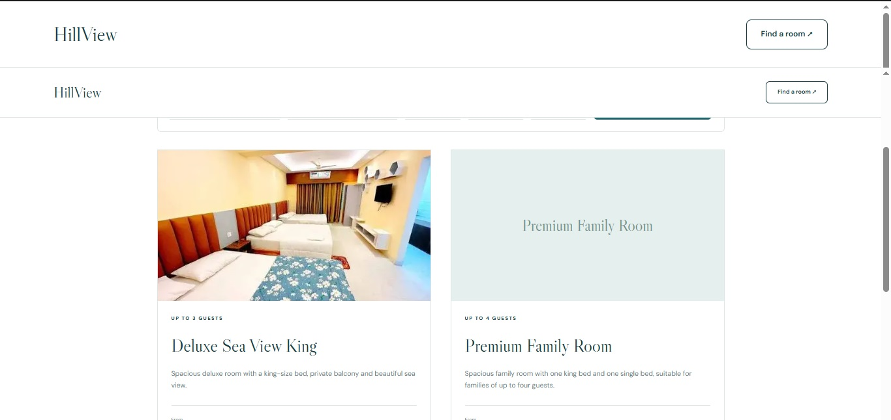

# Hotel Booking Platform

A property-management and direct-booking platform for boutique hotels, resorts, guest houses, and small multi-property operations. The application combines a public hotel website, booking engine, hotel back office, CMS, guest CRM, reporting, payment records, staff permissions, and operational tooling in one Next.js application.

The codebase is designed for a single property today and is property-scoped throughout the domain and database so that additional properties can be introduced without rebuilding the core model.

## Contents

- [Product Overview](#product-overview)
- [Screenshots](#screenshots)
- [Technology](#technology)
- [Requirements](#requirements)
- [Quick Start](#quick-start)
- [First-Run Setup](#first-run-setup)
- [Application Areas](#application-areas)
- [Typical Workflows](#typical-workflows)
- [Configuration](#configuration)
- [Project Structure](#project-structure)
- [Database and Migrations](#database-and-migrations)
- [Testing and Validation](#testing-and-validation)
- [Docker Deployment](#docker-deployment)
- [Backups and Restore](#backups-and-restore)
- [Security Model](#security-model)
- [Operational Notes](#operational-notes)
- [Known Scope](#known-scope)
- [Troubleshooting](#troubleshooting)
- [Documentation](#documentation)

## Product Overview

### Public website

The public application supports:

- Hotel homepage and custom CMS pages.
- Room listing and room detail pages.
- Availability search by dates, occupancy, and room count.
- Checkout with services, promotions, taxes, fees, and payment-method selection.
- Private booking confirmation pages.
- Contact and configurable inquiry forms.
- Offers, packages, testimonials, FAQs, galleries, nearby places, journal posts, and events.
- Published navigation, appearance, SEO, robots, sitemap, and website settings.

### Hotel workspace

The authenticated admin workspace supports:

- Dashboard metrics for occupancy, arrivals, departures, collections, balances, and recent reservations.
- Reservation search, creation, editing, rescheduling, cancellation, check-in, check-out, payment recording, refunds, and invoice access.
- Guest profiles, notes, preferences, VIP flags, blocks, duplicate detection, and reservation history.
- Room types, room units, amenities, images, housekeeping state, maintenance blocks, and availability calendar.
- Rate plans, seasonal overrides, stay rules, booking windows, promotions, services, taxes, and fees.
- Website pages, page-builder sections, draft/publish workflows, revisions, previews, navigation, media, forms, SEO, and configuration transfer.
- Staff accounts, roles, property-scoped permissions, audit history, and notification templates.
- Reports and CSV/Excel exports for bookings, room nights, revenue, payments, refunds, occupancy, ADR, RevPAR, taxes, promotions, and guests.

## Screenshots

The screenshots supplied with the project request show the current HillView workspace, including:

1. The dashboard overview with occupancy, arrivals, departures, collections, and outstanding balance.
2. The reservations list with status filtering and reservation search.
3. The room-type management screen with inventory and published status.
4. The rate-plan and pricing screen.
5. The website management screen with pages, appearance, header, and footer controls.

The repository includes the supplied screenshots in `docs/`:

```text
docs/Dashboard.jpg
docs/reservations.jpg
docs/rooms.jpg
docs/rates.jpg
docs/website.jpg
```

Recommended image gallery once the files are added:

```markdown





```

The screenshots are documentation assets only; they do not seed records or change application behavior.

### Public website screenshots

The public website is the guest-facing part of the platform. It is designed around a simple path from discovering the property to choosing a room and completing a reservation. The repository includes these public website captures in `docs/`:

```text
docs/website-home.jpg
docs/website-rooms.jpg
```

Recommended public website gallery:

```markdown


```

### Room visitor journey

Guests can visit the public website and move through the room booking journey without accessing the admin workspace:

1. **Homepage** - The guest sees the hotel's published brand, content sections, navigation, offers, and booking entry points at `/`.
2. **Room listing** - The guest browses available room types at `/rooms` and can search using check-in, check-out, adult, child, and room-count parameters.
3. **Room details** - The guest opens a specific room at `/rooms/[slug]` to review its description, capacity, amenities, media, policies, and available rates.
4. **Checkout** - The guest selects a rate and optional services at `/checkout`, enters contact details, applies an eligible promotion, reviews taxes and fees, accepts the booking policy, and submits the reservation.
5. **Confirmation** - The guest is redirected to a private confirmation URL under `/confirmation/[reference]`. The confirmation is protected by the booking session and is not publicly accessible by reference alone.

The visitor flow depends on published room data, active physical room units, active rate plans, availability rules, and published website settings. A room can appear in the admin workspace but remain unavailable to guests until it has inventory and a valid active rate.

When documenting or reviewing the guest experience, capture these states:

- Homepage with the primary booking action visible.
- Room listing with a date-based availability result.
- Room detail with room media, occupancy information, amenities, and rate choices.
- Checkout with the complete price breakdown and policy checkbox.
- Confirmation with the reservation reference and stay summary.

The public website reads published CMS content only. Draft pages, unpublished settings, private guest data, and internal administration screens must not appear in anonymous website screenshots.

## Technology

- Next.js 16 App Router.
- React 19.
- TypeScript 6.
- PostgreSQL 16 or newer. The local Docker setup currently uses PostgreSQL 17.
- Prisma 7 with the PostgreSQL adapter and custom SQL migrations where database constraints require them.
- Zod for runtime validation at domain and request boundaries.
- `pg` for PostgreSQL connectivity.
- `sharp` for image decoding, raster conversion, and optimized media delivery.
- Node's test runner through `tsx`.
- ESLint 9 with the Next.js configuration.
- Docker Compose for repeatable local and container deployment.

## Requirements

Install the following before starting:

- Node.js `22.12.0` or newer.
- npm.
- PostgreSQL 16 or newer, or Docker Desktop with Compose.
- `pg_dump` and `pg_restore` matching the database major version for backup operations.

Check the local versions:

```powershell
node --version
npm --version
docker --version
```

## Quick Start

### Option A: existing local PostgreSQL or Docker database

1. Create the environment file:

   ```powershell
   Copy-Item .env.example .env
   ```

2. Set `DATABASE_URL`, `APP_URL`, `SETUP_TOKEN`, and `SESSION_SECRET` in `.env`.
3. Install dependencies:

   ```powershell
   npm ci
   ```

4. Validate the Prisma schema and apply migrations:

   ```powershell
   npm run db:validate
   npm run db:migrate
   ```

5. Start the development server:

   ```powershell
   npm run dev
   ```

6. Open [http://localhost:3000/setup](http://localhost:3000/setup) for first-run setup.

The local development server binds to `127.0.0.1`, but use the exact origin in `APP_URL` when testing browser mutations. If `.env` uses `http://localhost:3000`, use `http://localhost:3000` in the browser.

### Option B: Docker Compose

Create a Compose `.env` file containing at least:

```dotenv
POSTGRES_PASSWORD=replace-with-a-long-local-password
APP_URL=http://localhost:3000
SESSION_SECRET=replace-with-at-least-32-random-bytes
SETUP_TOKEN=replace-with-a-long-one-time-token
```

Then run:

```powershell
docker compose up --build -d
```

Open [http://localhost:3000/setup](http://localhost:3000/setup). Verify readiness:

```powershell
curl.exe --fail http://localhost:3000/api/health
```

Expected response:

```json
{"status":"ok"}
```

## First-Run Setup

There is intentionally no default administrator account or fabricated production password.

1. Generate a setup token with at least 32 random bytes.
2. Put the token in `SETUP_TOKEN`.
3. Open `/setup`.
4. Enter the setup token, hotel name, administrator name, administrator email, password, currency, and timezone.
5. Submit the form. The first account receives the `Super Admin` role and a session is created.
6. Remove `SETUP_TOKEN` from the runtime environment after setup.
7. Use `/login` for subsequent sign-ins.

The password must be at least 12 characters. Setup is protected by a transactional singleton lock, so two simultaneous setup requests cannot create two properties.

Useful local commands:

```powershell
# Display only the setup token value, without changing it.
(Get-Content .env | Where-Object { $_ -match '^SETUP_TOKEN=' }) -replace '^SETUP_TOKEN=',''

# Check the application.
Invoke-WebRequest -UseBasicParsing http://localhost:3000/api/health
```

## Application Areas

### Dashboard

The dashboard is the operating starting point for staff. It uses the property's timezone for local-day arrival and departure calculations and separates collected funds from outstanding balances. Empty states represent real empty data; the application does not invent reservations, revenue, or room activity.

### Reservations

Reservations can be created through the public checkout or manually by staff. The booking service validates dates, occupancy, room capacity, rates, restrictions, taxes, services, promotions, and expected totals before creating a reservation.

Important behaviors:

- Check-out is exclusive: a stay from June 10 through June 12 allocates June 10 and June 11.
- Every room night is allocated transactionally.
- Competing reservations are protected by database constraints and stable locking.
- Idempotency keys prevent duplicate booking requests.
- Price and policy snapshots preserve the terms accepted at booking time.
- Rescheduling protects the original inventory until the new stay is accepted.
- Terminal bookings cannot be resurrected.

### Rooms and inventory

Room types describe sellable accommodation. Room units represent physical inventory. Availability is derived from physical units, reservations, maintenance blocks, and calendar allocations rather than from a manually maintained room count.

Room media is validated, decoded, resized, rasterized where appropriate, and served through optimized paths. Executable and unsafe SVG uploads are rejected.

### Rates and pricing

Rate plans support base and weekend prices, stay limits, cancellation policies, seasonal overrides, and date-specific rules. Pricing uses exact decimal values and persists a snapshot with the reservation.

The checkout calculation can include:

1. Nightly room rates.
2. Occupancy and guest adjustments.
3. Selected services.
4. Promotion discounts.
5. Included or excluded taxes and fees.
6. The final expected total.

Equal-priority conflicting overrides are rejected instead of being resolved unpredictably.

### Website and CMS

The website area separates working drafts from published content. Pages and settings can be edited without changing source code. Publishing creates an immutable revision used by public readers. Preview requires authentication and does not expose drafts to anonymous visitors.

The page builder uses registered section types and validated content rather than arbitrary component paths, executable JavaScript, or unsanitized database HTML.

Navigation supports header and footer menus, ordered items, nested parents, internal paths, external HTTP/HTTPS URLs, and CMS page targets. Labels and links are validated before persistence, parent relationships are checked for cycles, and save operations are transactional.

### Guests and CRM

Guest records contain contact details, preferences, notes, VIP state, booking blocks, and reservation history. Guest edits use stale-version protection. Staff actions are property-scoped and audited.

### Payments and finance

The current supported financial paths are offline and manually verified payments, including pay-at-hotel concepts. Payment recording, refunds, invoices, credit notes, duplicate requests, and refund bounds are validated transactionally.

Provider contracts alone are not treated as live payment integrations. Online gateway work must pass provider, webhook signature, amount, currency, idempotency, and reconciliation tests before being enabled.

### Forms and notifications

Setup creates editable contact and newsletter forms. Staff can review, resolve, reopen, and confirmed-delete submissions. Notification templates validate placeholders and queue delivery through the outbox. The worker is required for scheduled publishing and external email delivery.

### Reports and exports

Reports use the property's timezone and distinguish cash collection from room revenue. Authenticated exports include CSV and Excel output with formula-injection protection and permission checks.

## Typical Workflows

### Configure a hotel

1. Complete `/setup`.
2. Open the admin workspace.
3. Configure hotel details, currency, timezone, check-in, and check-out settings.
4. Add room types.
5. Add physical room units.
6. Add rate plans.
7. Review booking rules, taxes, services, and promotions.
8. Create and publish website pages.
9. Configure appearance, header, footer, navigation, SEO, and forms.
10. Run a public availability search and a test reservation.

### Create a bookable room

1. Create a room type with capacity, price, slug, and description.
2. Add at least one active physical room unit.
3. Create an active rate plan for the room type.
4. Confirm the rate's stay and cancellation rules.
5. Search availability from the public website.
6. Complete checkout using a test guest record.

### Publish a page

1. Open Website > Pages.
2. Create or edit a page.
3. Save a draft and confirm anonymous visitors cannot see it.
4. Preview the draft while authenticated.
5. Publish the page.
6. Open the public slug and verify the published revision.
7. Edit a new draft and confirm the previous published version remains public until the next publish.

### Configure navigation

1. Open Website > Navigation.
2. Choose Header or Footer.
3. Add labels and internal paths such as `/`, `/rooms`, `/gallery`, or `/contact`.
4. Use CMS page targets when a link should follow a managed page slug.
5. Assign a parent to create a dropdown.
6. Move items to preserve the desired order.
7. Save and refresh the page to confirm persistence.

## Configuration

Copy `.env.example` to `.env`. Never commit `.env` or provider credentials.

| Variable | Required | Purpose |
| --- | --- | --- |
| `DATABASE_URL` | Yes | PostgreSQL connection string. |
| `APP_URL` | Yes | Canonical origin used for links and Origin validation. |
| `SESSION_SECRET` | Production | Session and application secret material. Use at least 32 random bytes. |
| `SETUP_TOKEN` | First run | Temporary token for creating the first property and Super Admin. Remove after setup. |
| `TEST_DATABASE_URL` | Database tests | Dedicated disposable test database only. |
| `EMAIL_API_KEY` | Email delivery | Provider credential for the configured email transport. |
| `EMAIL_FROM` | Email delivery | Verified sender address. |
| `EMAIL_PROVIDER` | Optional | Email provider selection. |
| `PAYMENT_SECRET_KEY` | Optional | Provider secret when a supported adapter is enabled. |
| `PAYMENT_WEBHOOK_SECRET` | Optional | Signed webhook verification secret. |
| `S3_ENDPOINT` | Optional | Object-storage endpoint for a future storage adapter. |
| `S3_REGION` | Optional | Object-storage region. |
| `S3_BUCKET` | Optional | Object-storage bucket. |
| `S3_ACCESS_KEY_ID` | Optional | Object-storage access identifier. |
| `S3_SECRET_ACCESS_KEY` | Optional | Object-storage secret. |
| `REDIS_URL` | Optional | Shared infrastructure for future rate-limit or queue adapters. |

External provider secrets are deliberately excluded from CMS configuration exports.

## Project Structure

```text
src/
  app/          Next.js routes, layouts, API handlers, public pages, setup, and admin pages
  components/   Reusable forms, editors, booking UI, CMS renderer, navigation, and admin UI
  domain/       Framework-independent schemas, rules, pricing, permissions, and invariants
  ports/        Provider interfaces and integration boundaries
  server/       Authentication, database access, booking services, actions, reports, and workers
prisma/
  schema.prisma Database model source
  migrations/   Authoritative migration history
generated/      Generated Prisma client output
tests/          Unit, domain, HTTP, and database integration tests
docs/           Architecture, requirements, design, status, and gap analysis
scripts/        Worker, database, backup, restore, and HTTP acceptance utilities
```

## Database and Migrations

Prisma migrations are the authoritative database history. Apply them before starting a new environment:

```powershell
npm run db:validate
npm run db:migrate
npm run db:status
npm run db:generate
```

The database uses property ownership and composite relationships to prevent cross-property records. PostgreSQL constraints and triggers protect inventory, payment, refund, and booking invariants that cannot be expressed safely in application code alone.

Do not edit an already-applied migration. Add a new migration for schema changes and regenerate the Prisma client.

## Testing and Validation

Run the complete local validation sequence:

```powershell
npm run db:validate
npm run typecheck
npm run lint
npm run test
npm run test:database
npm run build
npm run test:local-db
npm run test:http
npm audit --omit=dev
```

Focused commands:

```powershell
npx tsx --test tests/navigation.test.ts
npx tsx --test tests/pricing.test.ts
npx tsx --test tests/booking-options.test.ts
```

The HTTP harness creates an isolated disposable database, applies migrations, starts a production build, exercises setup/authentication, creates rooms and rates, tests concurrent bookings, tests payments and refunds, checks CMS publication, validates forms and media, and removes its test database afterward.

Never point `TEST_DATABASE_URL` at production or a developer's primary database.

## Docker Deployment

The Compose file defines:

- `postgres`: PostgreSQL database.
- `migrate`: one-shot migration service.
- `web`: Next.js production server on port `3000`.
- `worker`: optional notification and scheduled-publishing worker under the `notifications` profile.

Start the application:

```powershell
docker compose up --build -d
```

Start the worker after email configuration:

```powershell
docker compose --profile notifications up -d worker
```

Inspect service state and logs:

```powershell
docker compose ps
docker compose logs --tail=200 web
docker compose logs --tail=200 postgres
```

Terminate TLS at a reverse proxy or load balancer. Set `APP_URL` to the exact HTTPS origin and do not expose PostgreSQL publicly. The web container runs as an unprivileged user and stores local uploads in a named volume.

## Backups and Restore

Stop application writes and the worker before backing up so database and media snapshots agree.

Create a backup:

```powershell
npm run backup -- backups/2026-09-08
```

Restore only into an empty or disposable environment first:

```powershell
npm run restore -- backups/2026-09-08 --confirm=RESTORE
npm run db:migrate
npm run db:status
```

Backups include database and local media but intentionally exclude environment secrets. Store secrets separately in the deployment secret manager. After a rehearsal, verify health, sign-in, media, availability, a test reservation, payment records, and public content before scheduling a production restore.

## Security Model

- First-run setup uses a temporary token and a database advisory lock.
- Passwords are salted and hashed with scrypt.
- Sessions store token digests, not raw session tokens.
- Session cookies are HttpOnly, SameSite=Lax, path-scoped, and Secure in production.
- Mutating requests validate the trusted Origin.
- Authentication, setup, and reset flows use persistent request limits.
- Every protected operation checks the authenticated property membership and permission server-side.
- Staff cannot grant permissions they do not possess.
- Public content reads published revisions only.
- Uploads validate file size, type, signatures, and decoded image data.
- Secrets and unnecessary request bodies are excluded from logs and configuration exports.
- Financial operations use idempotency and bounded refund checks.
- Audit records are written with important administrative mutations.

## Operational Notes

The application is a working implementation with a validated core, not a production-readiness certification. Before launch:

- Run the full build, lint, type, unit, HTTP, and database suites.
- Perform browser, keyboard, accessibility, and mobile checks.
- Test the exact deployment database and restore procedure.
- Configure HTTPS and security headers at the edge.
- Verify email sender authentication and worker delivery.
- Monitor database health, disk capacity, uploads, logs, and worker retries.
- Replace local media storage with an object-storage implementation before scaling web replicas.
- Enable payment, storage, SMS, WhatsApp, or channel-manager integrations only after independent integration and webhook tests.

## Known Scope

The following areas remain outside the verified core or require additional production work:

- Live online card and mobile-wallet gateway integrations.
- Live external email delivery verification.
- Object-storage adapter implementation.
- Full localization and advanced content constraints from the complete requirements brief.
- Browser visual and accessibility acceptance across supported devices.
- Production backup/restore rehearsal and deployment certification.

Provider interfaces in `src/ports` describe extension points; an interface is not itself a completed integration.

## Troubleshooting

### `/api/health` returns `503`

Check PostgreSQL first:

```powershell
docker ps
Test-NetConnection 127.0.0.1 -Port 55432
npm run db:status
```

If the existing local container is stopped:

```powershell
docker start booking-postgres
```

Compose requires `POSTGRES_PASSWORD`. Put it in the Compose `.env` file before running `docker compose up`.

### `/login` redirects to `/setup`

No property exists in the configured database. Complete first-run setup at `/setup`.

### Mutations fail with an origin error

Use the exact origin configured in `APP_URL`. For example, do not switch between `localhost` and `127.0.0.1` during a session when only one is configured as the canonical origin.

### Prisma reports missing tables or columns

Apply migrations and regenerate the client:

```powershell
npm run db:migrate
npm run db:generate
```

### The notification queue does not send mail

Confirm `EMAIL_API_KEY`, `EMAIL_FROM`, provider configuration, sender verification, and a running worker:

```powershell
npm run worker
```

### A test changes real data

Stop and inspect `DATABASE_URL` and `TEST_DATABASE_URL`. HTTP and database suites must use isolated disposable databases. Do not run them against production.

## Documentation

- [Architecture](docs/ARCHITECTURE.md)
- [Design direction](docs/DESIGN.md)
- [Requirements](docs/REQUIREMENTS.md)
- [Implementation status](docs/IMPLEMENTATION-STATUS.md)
- [Gap analysis](docs/GAP-ANALYSIS.md)
- [Database schema](prisma/schema.prisma)
- [Environment template](.env.example)

## License and Contributions

This repository is private application code. Keep credentials, guest data, database exports, uploaded media, and deployment configuration out of commits. Changes should include the smallest relevant test coverage and should preserve property ownership, authorization, transactional behavior, and published-content boundaries.
